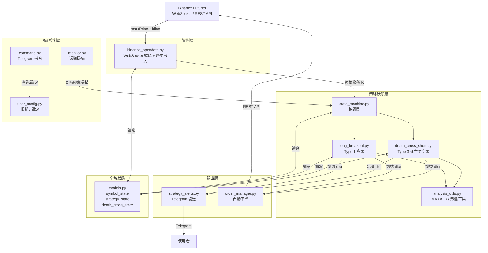
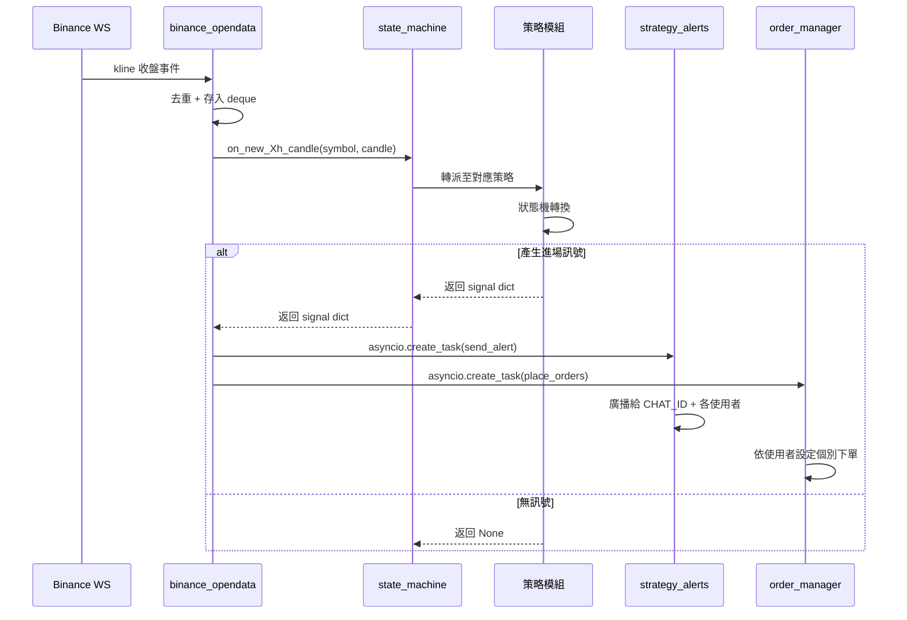
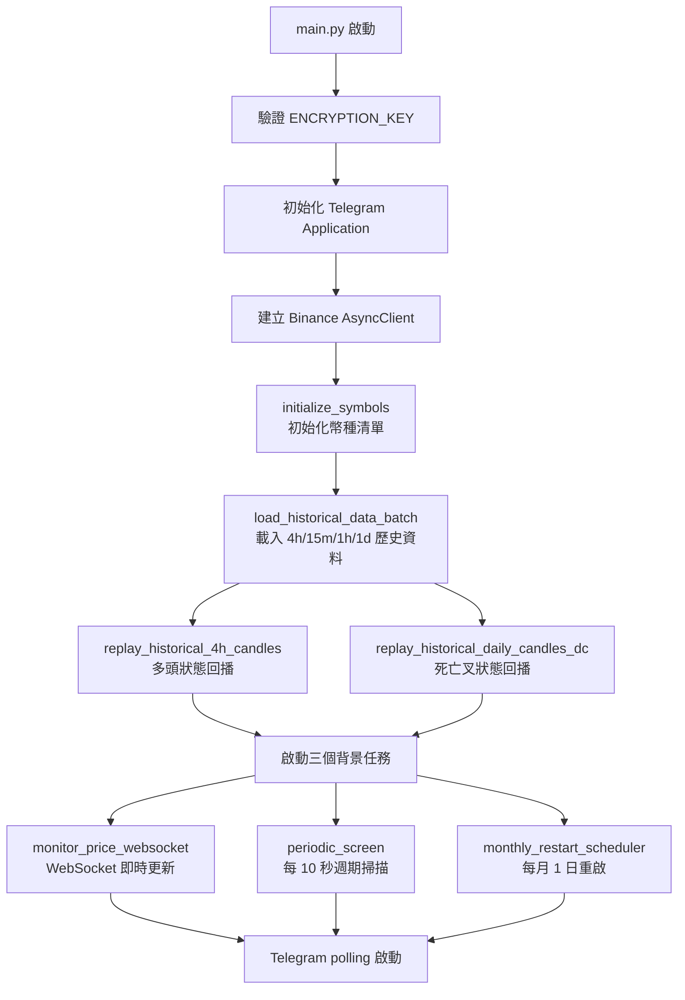
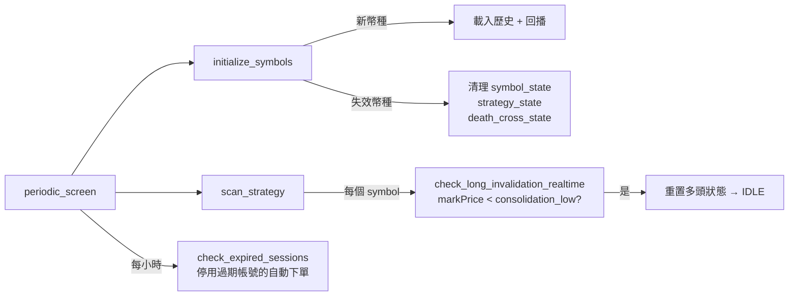
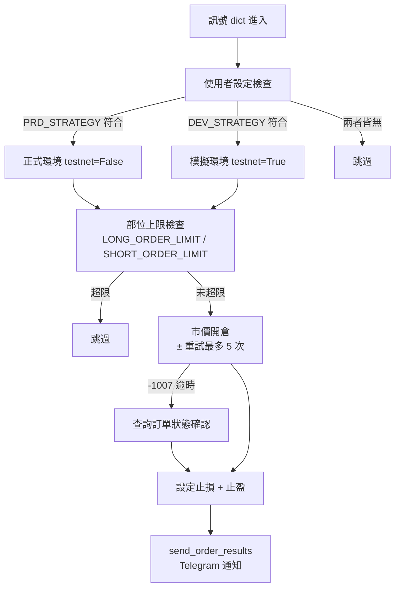

# Architecture Overview

> 本文描述系統整體架構、資料流向與各模組職責。策略的詳細行為規格見 [`docs/specs/`](../specs/)，設計決策背後的理由見 [`docs/decisions/`](../decisions/)。

---

## 系統全貌

---

## 資料流：從 WebSocket 到訊號

> **關鍵原則**：WebSocket handler 不得阻塞。所有 Telegram 發送與 Binance 下單都透過 `asyncio.create_task()` 非同步執行。

---

## 模組職責

### 資料層

| 模組 | 職責 |
|------|------|
| `binance_opendata.py` | WebSocket 多路監聽（markPrice + kline_15m/1h/4h/1d） 歷史資料批次載入（REST API，限流控制） 自動重連（指數退避，最高 60s） 去重處理（`last_kline_close_time_Xm`） |

### 策略狀態層

| 模組 | 職責 |
|------|------|
| `state_machine.py` | 協調器（Orchestrator）：對外維持統一 API，內部分派給各策略 外部模組只 import 此檔，不直接 import 策略模組 |
| `long_breakout.py` | Type 1 多頭狀態機（IDLE / TRACKING / READY） 4h 收盤觸發狀態轉換，15m 收盤偵測進場訊號 |
| `death_cross_short.py` | Type 3 死亡叉狀態機（IDLE / WATCHING / ALERT） 日線收盤更新格局，1h 收盤偵測進場信號 |
| `analysis_utils.py` | 共用工具：EMA 計算、ATR 計算、K 棒形態判斷、方向感知函數 |

### 輸出層

| 模組 | 職責 |
|------|------|
| `strategy_alerts.py` | 訊號格式化（Markdown） 通知路由：CHAT_ID 全量接收；個別使用者依 `NOTIFY_STRATEGY` 過濾 開單結果廣播 |
| `order_manager.py` | 依使用者設定（PRD/DEV）決定正式或模擬環境 市價開倉 + SL/TP 設定 Binance -1007 逾時自動查詢重試 部位上限檢查、加倉保護 |

### Bot 控制層

| 模組 | 職責 |
|------|------|
| `command.py` | Telegram 指令處理：`/register`、`/login`、`/setup`、`/myconfig`、`/tracking` 等 |
| `monitor.py` | 週期掃描（每 10 秒）：幣種清單更新、即時廢棄掃描、session 過期檢查 |
| `user_config.py` | 帳號系統（Fernet 加密存檔）、session 管理、使用者設定讀寫 |

### 全域狀態

| 容器 | 內容 | 管理方 |
|------|------|--------|
| `symbol_state` | 每幣種即時狀態（price, kline deques） | `binance_opendata` |
| `strategy_state` | 多頭策略狀態 dict（per symbol） | `long_breakout` |
| `death_cross_state` | 死亡叉策略狀態 dict（per symbol） | `death_cross_short` |

---

## 啟動流程

> **歷史回播的目的**：啟動時從 Binance 載入歷史 K 棒，依序重播以恢復策略狀態，確保重啟後不遺失進行中的盤整追蹤或死亡叉監控。

---

## 週期掃描（每 10 秒）

---

## Candle Tuple 格式

所有時框統一：`(open_time_ms, open, high, low, close, quote_volume)`

| 時框 | deque | maxlen | 用途 |
|------|-------|--------|------|
| 1d | `kline_daily_ohlc` | 250 | EMA200(D) 需 200 根，250 根緩衝 |
| 4h | `kline_4h_ohlc` | 200 | 多頭狀態機驅動 + EMA 計算 |
| 1h | `kline_1h_ohlc` | 250 | 死亡叉 1H 信號 + EMA200(1H) + ATR(14) |
| 15m | `kline_15m_ohlc` | 200 | Type 1 突破進場量能計算（192 根 baseline） |

> 時間欄位用 `k["t"]`（open_time_ms），不用 `k["T"]`（close_time_ms）。

---

## 自動下單邏輯

---

## 訊號通知路由

| 接收對象 | 條件 | 收到哪些訊號 |
|---------|------|------------|
| `CHAT_ID`（公頻） | 無條件 | 所有 Type 1 + Type 3 |
| 個別使用者（有設定 `NOTIFY_STRATEGY`） | 策略代號在陣列中 | 只收符合的策略訊號 |
| 個別使用者（`NOTIFY_STRATEGY = []`） | 靜默 | 不收任何訊號 |
| 個別使用者（無 `NOTIFY_STRATEGY` 欄位） | 提醒設定 | 收到提示訊息要求更新設定 |
