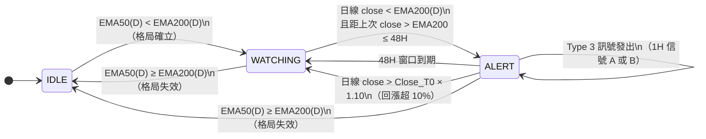

# Spec: Death Cross Short Strategy（死亡叉制空）

> **實作位置**：[app/strategy/death_cross_short.py](../../app/strategy/death_cross_short.py)  
> **對應訊號**：Type 3（做空）  
> **策略代號**：`death_cross_short`

---

## 策略概念（三層結構）

```
Layer 1 (日線，持續監控)  EMA50(D) < EMA200(D) → 格局確立
Layer 2 (日線，每日確認)  close(D) < EMA200(D) + 時效 ≤ 48H → 進入 ALERT 窗口
Layer 3 (1H，即時監控)   ALERT 窗口內，1H 信號 A 或 B → 做空進場
```

---

## 狀態機總覽



---

## 狀態說明

| 狀態 | 意義 |
|------|------|
| `IDLE` | EMA50 ≥ EMA200，不監控任何信號 |
| `WATCHING` | 死亡叉格局確立，等待日線確認跌破 EMA200 |
| `ALERT` | 48H 監控窗口啟動，等待 1H 進場信號 |

---

## Layer 1：格局判斷（每根日線 K 棒）

**觸發進入 WATCHING 的條件**：

```
EMA50(D) < EMA200(D)
```

**回到 IDLE 的條件**（優先於其他所有判斷）：

```
EMA50(D) ≥ EMA200(D)
```

> 格局失效時，無論當前在 WATCHING 還是 ALERT，都立即回 IDLE。

---

## Layer 2：日線跌破確認（→ ALERT）

**條件**（WATCHING 狀態下，每根日線收盤評估）：

| # | 條件 | 說明 |
|---|------|------|
| 1 | `close(D) < EMA200(D)` | 日線實體跌破 EMA200 |
| 2 | 時效性：距上次 `close > EMA200` 的日線 ≤ 48H | 跌破需是「新鮮」的，太久以前的跌破不算 |

**時效性判斷細節**：

```
向前掃描 kline_daily_ohlc（排除當根）
找到最近一根 close > EMA200 的日線 K 棒
計算 (當根 open_time - 該根 open_time) / 3600 → 若 > 48H 則略過
若找不到任何 close > EMA200 的日線 → 略過（不進入 ALERT）
```

**進入 ALERT 時記錄**：

| 欄位 | 值 |
|------|----|
| `alert_time` | 當根日線的 `open_time_ms / 1000`（窗口起點） |
| `close_t0` | 當根日線的 `close`（幅度保護基準） |
| `entry_count` | 重置為 0 |

---

## ALERT 窗口廢棄條件（→ WATCHING）

以下任一條件成立時退回 WATCHING（由日線或 1H 收盤觸發檢查）：

| 條件 | 說明 |
|------|------|
| `candle_ts - alert_time > 48H` | 監控窗口到期 |
| `close > close_t0 × DC_PRICE_RECOVERY_PCT (1.10)` | 日線或 1H 收盤回漲超過 T0 價格的 10% |

---

## Layer 3：1H 進場信號

**前置檢查**（進入信號偵測前，以下任一條件不符則跳過）：

| 條件 | 說明 |
|------|------|
| 狀態必須是 ALERT | |
| 48H 窗口未到期 | |
| 1H close 未超幅度保護 | |
| `entry_count < DC_MAX_ENTRIES_PER_ALERT (2)` | 同一 ALERT 窗口最多 2 次 |
| `candle_ts - last_entry_ts >= STRATEGY_COOLDOWN (4H)` | 兩次進場間隔 ≥ 4H |
| `EMA200(1H)` 計算成功 | 需至少 200 根 1H K 棒 |
| `ATR(14, 1H)` 計算成功 | 需至少 15 根 1H K 棒 |

**信號偵測優先順序：A 優先於 B**

---

### 信號 A：拒絕蠟燭（Rejection Candle）

| # | 條件 | 說明 |
|---|------|------|
| 1 | `high > EMA200(1H)` | 上影線刺穿 EMA200 |
| 2 | `close < EMA200(1H)` | 收盤壓回 EMA200 下方 |
| 3 | `(EMA200 - close) / EMA200 >= 0.5%` | 至少 0.5% 壓制幅度 |
| 4 | `close < open` | 陰線實體向下 |

> **注意**：信號 A **沒有量能要求**。`vol_ratio` 欄位只是相對前根的量能倍數，僅供顯示用，不作為觸發條件。

---

### 信號 B：吞噬型態（Engulfing Pattern）

| # | 條件 | 說明 |
|---|------|------|
| 1 | `close < EMA200(1H)` | 收盤在 EMA200 下方 |
| 2 | `open > close(前根)` | 跳空高開 |
| 3 | `close < close(前根)` | 收盤低於前根收盤 |
| 4 | `\|close - open\| > \|前根實體\| × 1.5` | 實體吞噬 1.5 倍 |
| 5 | `volume > 前根 volume × 1.5` | 帶量 1.5 倍 |

> 前根取 `kline_1h_ohlc[-2]`（倒數第 2 根，即已收盤的前一根）。

---

## 止損計算

```
stop_loss = EMA200(1H) + ATR(14, 1H)
```

ATR 使用 Wilder 平均法（簡化為最近 14 根 True Range 的平均值）。

---

## 訊號回傳格式

```python
{
    "type":                "type3",
    "strategy":            "death_cross_short",
    "symbol":              symbol,
    "close":               close,           # 進場價
    "stop_loss":           stop_loss,       # EMA200(1H) + ATR(14)
    "signal_type":         "rejection" | "engulfing",
    "ema200_1h":           ema200_1h,
    "atr_14_1h":           atr_14_1h,
    "close_t0":            close_t0,        # T0 日線收盤（幅度保護基準）
    "vol_ratio":           vol_ratio,       # 相對前根量能倍數（顯示用）
    "candle_open_time_ms": candle[0],
}
```

---

## 歷史回播

啟動時呼叫 `replay_historical_daily_candles(symbol)`：
- 依序重播 `kline_daily_ohlc` 所有日線 K 棒
- 恢復 IDLE / WATCHING / ALERT 狀態
- 需要至少 **200 根**日線 K 棒（EMA200 計算需求），`kline_daily_ohlc` 的 maxlen 為 250

---

## 邊界案例

| 情境 | 行為 |
|------|------|
| 無任何 `close > EMA200` 的歷史日線 | 時效性檢查失敗，不進入 ALERT |
| 1H 進場後立即發生幅度超限 | 下一根 1H 收盤時偵測到，退回 WATCHING |
| 48H 窗口在 1H 收盤時到期 | `on_new_1h_candle` 先做到期檢查，退回 WATCHING，不發訊號 |
| 同一 ALERT 連續出現 A 和 B 信號 | 第 1 次 A 訊號進場，冷卻 4H 後若符合條件可再進場（最多 2 次） |
| A、B 同一根 K 棒同時成立 | 優先採用信號 A（A 先檢查，B 僅在 A 為 None 時才檢查） |
| `kline_1h_ohlc` 少於 200 根 | EMA200(1H) 計算回傳 None，跳過所有 1H 信號 |

---

## 明確排除（不在此策略範圍）

- **即時廢棄**：此策略無 markPrice 即時廢棄機制，廢棄只在日線或 1H 收盤時評估
- **信號 A 無量能要求**：vol_ratio 僅供訊號顯示，不構成進場條件
- **WATCHING 狀態**不偵測 1H 信號，只有 ALERT 狀態才有 Layer 3 邏輯

---

## 關鍵參數

| 參數 | 預設值 | 說明 |
|------|--------|------|
| `DC_DAILY_EMA_FAST` | 50 | Layer 1 短均線（EMA50，日線） |
| `DC_DAILY_EMA_SLOW` | 200 | Layer 1/2 長均線（EMA200，日線） |
| `DC_1H_EMA_PERIOD` | 200 | Layer 3 壓制均線（EMA200，1H） |
| `DC_1H_ATR_PERIOD` | 14 | 止損 ATR 週期（1H） |
| `DC_ALERT_WINDOW_HOURS` | 48 | ALERT 監控窗口時數 |
| `DC_MAX_ROLLBACK_HOURS` | 48 | 時效性：距上次 close > EMA200 上限（小時） |
| `DC_PRICE_RECOVERY_PCT` | 1.10 | 幅度保護：Close_T0 × 此值超限廢棄 |
| `DC_MAX_ENTRIES_PER_ALERT` | 2 | 每 ALERT 最大進場次數 |
| `DC_REJECTION_BODY_PCT` | 0.005 | 信號 A 最低壓制幅度（0.5%） |
| `DC_ENGULF_BODY_RATIO` | 1.5 | 信號 B 實體吞噬倍數 |
| `DC_ENGULF_VOLUME_RATIO` | 1.5 | 信號 B 量能倍數 |
| `STRATEGY_COOLDOWN` | 14400 | 進場間冷卻（秒，4H，與 Type 1 共用） |
