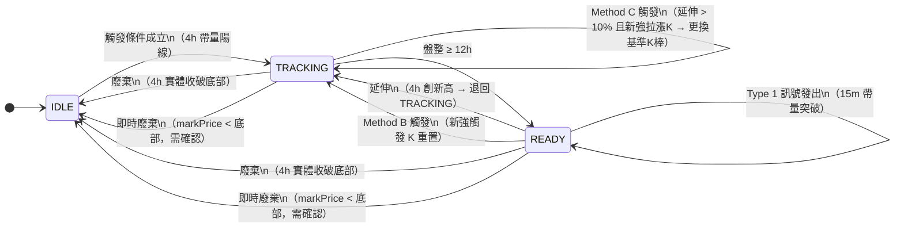

# Spec: Long Breakout Strategy（多頭盤整突破）- V2 版本

> **實作位置**：[app/strategy/long_breakout.py](../../app/strategy/long_breakout.py)  
> **對應訊號**：Type 1（做多）  
> **策略代號**：`long_breakout`  
> **版本更新**：V1 → V2（2024 優化版）

---

## 版本變更摘要

| 項目 | V1 | V2 | 改進原因 |
|------|-----|-----|---------|
| 止損回掃 | 連續放量 K | 最強放量 K | 避免漏掉關鍵支撑位 |
| Method B 觸發 | 比較漲幅強弱 | 加入體量驗證 | 防止虛脫重置 |
| 觸發漲幅門檻 | 固定 3% | 動態 2.5-3.5% | 適應市場環境 |
| 即時廢棄 | 單次掃描 | 三次確認 | 防止虛假廢棄 |
| 進場確認 | 實體突破 0.5% | 加入體強度+ATR | 確保突破力度 |
| Pump 驗證 | 無 | Taker Buy Ratio | 防止對敲虛假單 |
| 技術面濾波 | 無 | MA 均線確認 | 避免逆勢進場 |
| 冷卻期 | 全局 4h | 三層檢查機制 | 增加機會同時防重複 |
| <span style="color: red;">**Method C（新增）**</span> | 無 | <span style="color: red;">追蹤階段延伸超過門檻後允許更換基準K棒</span> | 防止基準K棒資料過時 |

---

## <span style="color: red;">**K 線定義區（V2 新增，重要）**</span>

<span style="color: red;">
為避免實裝時的混淆，明確定義本策略中各個場景使用的 K 線部分：

```
K 線結構圖：
        ↑ high（最高點，包括上影線）
        │
    ╔═══╗  ← close（收盤）
    ║   ║
    ╚═══╝  ← open（開盤）
        │
        ↓ low（最低點，包括下影線）

上影線：max(open, close) 到 high 之間
下影線：low 到 min(open, close) 之間
實體：open 到 close 之間
```

### **各場景使用規則**

| 場景 | 使用部分 | 原因 |
|------|---------|------|
| `consolidation_high` 記錄 | **high**（影線最高點） | 定義整個盤整的頂部範圍 |
| `consolidation_low` 記錄 | **low**（影線最低點） | 定義整個盤整的底部範圍 |
| 4h 收盤廢棄判斷 | **min(open, close)**（實體最低） | 防止虛假下影線造成誤廢棄 |
| 15m 進場突破判斷 | **close**（收盤價） | 確認真實突破確認 |
| 即時廢棄判斷 | **markPrice** | 實時行情價格 |

### **具體例子**

```
觸發 K 棒（4h）：
  open = 100
  close = 103  (+3%)
  high = 105   ← 上影線
  low = 98     ← 下影線
  
  記錄：
    consolidation_high = 105（整根 K 的最高點）
    consolidation_low = 98（整根 K 的最低點）

後續盤整 K 棒 A（4h）：
  open = 102
  close = 101
  high = 104
  low = 97   ← 探得比觸發 K 還低
  
  廢棄判斷：
    min(open, close) = 101 > 98？✓ 是
    → 不廢棄（實體沒破）
    → 即使下影線穿過 98，也視為有效盤整
    
  為何？防止單根下影線的虛假探底
```

</span>

---

## 狀態機總覽



---

## 狀態說明

| 狀態 | 意義 |
|------|------|
| `IDLE` | 無進行中的盤整，等待觸發 K 棒出現 |
| `TRACKING` | 觸發後追蹤盤整，等待足夠盤整時間累積 |
| `READY` | 盤整成熟，監控 15m K 棒等待突破進場 |

---

## 觸發條件（IDLE → TRACKING）

每根 4h K 棒收盤時評估，**以下三條件須同時成立**：

### V1 觸發條件（保留參考）

| # | 條件 | 計算方式 |
|---|------|---------|
| 1 | 陽線 | `close > open` |
| 2 | 單根漲幅 ≥ 3% | `(close - open) / open × 100 >= PUMP_THRESHOLD` |
| 3 | 量能 > 前 12 根均量 × 3 | `quote_volume / avg_12_4h > TRIGGER_VOLUME_MULT`（嚴格 `>`） |

### <span style="color: red;">**V2 優化：PUMP_THRESHOLD 動態化**</span>

<span style="color: red;">
根據 BTC 24h 漲幅動態調整觸發漲幅門檻：

```python
# 每根 4h K 收盤時執行
btc_24h_candle = get_btc_1d_kline()  # 獲取 BTC 當前 1d K 線
btc_24h_change = (btc_24h_candle.close - btc_24h_candle.open) / btc_24h_candle.open * 100

if btc_24h_change > 3.0:  # 牛市訊號
    PUMP_THRESHOLD = 3.5%
    DESC = "市場強勢，提高門檻"
elif -3.0 <= btc_24h_change <= 3.0:  # 震盪市
    PUMP_THRESHOLD = 3.0%
    DESC = "預設"
else:  # 熊市（btc_24h_change < -3.0）
    PUMP_THRESHOLD = 2.5%
    DESC = "市場弱勢，降低門檻"
```

**說明**：
- 牛市中 3% 容易誤觸發低質盤整，提高到 3.5%
- 熊市中 3% 稀有，降至 2.5% 抓住難得機會
- 此參數**每根 4h K 評估一次**，確保實時適應

**V2 新增欄位記錄**：
- `btc_24h_change`：當前 BTC 24h 漲幅（用於告警日誌）
- `pump_threshold_applied`：實際應用的門檻值
</span>

> `avg_12_4h`：取 `kline_4h_ohlc` 最後 13 根中的**前 12 根**（排除當根）的 quote_volume 平均值。

觸發後記錄：

| 欄位 | 值 |
|------|----|
| `consolidation_low` | 觸發 K 棒的 `low`（廢棄線） |
| `consolidation_high` | 觸發 K 棒的 `high`（突破目標） |
| `consolidation_start_ts` | 觸發 K 棒的 `open_time_ms / 1000`（計時起點） |
| `pump_candle_*` | 觸發 K 棒完整資訊（用於 Method B 比較與告警訊息） |
| <span style="color: red;">**`pump_candle_volume`**</span> | <span style="color: red;">觸發 K 棒的成交量（用於 Method B 體量驗證）</span> |

---

## 延伸條件（重置計時，退回 TRACKING）

適用狀態：`TRACKING`、`READY`

**條件**：4h `high > consolidation_high`

**行為**：
- 更新 `consolidation_high = high`
- 重置 `consolidation_start_ts = 當根 open_time / 1000`
- 狀態強制回到 `TRACKING`（若原本是 READY 則退回）
- 立即重新評估是否達到 12h → 若當根時間距離等於或超過 12h，會再次進入 READY

---

## 廢棄條件（→ IDLE）

### 4h 收盤廢棄

**條件**：`min(open, close) < consolidation_low`（實體低點，不含下影線）

<span style="color: red;">
**為何用實體而非 low？**
參考上方「K 線定義區」的例子。使用實體可防止虛假下影線造成誤廢棄。

例：觸發 K 的 low=98，但某根 K 的下影線穿過 98 到 97，若用 `low` 比較就會誤廢棄。但實際上該 K 的收盤價可能在 100 以上，表示買盤支撑有效。用 `min(open, close)` 才能真正反映實體破位。
</span>

**行為**：重置為 IDLE

### <span style="color: red;">**即時廢棄（V2 優化：防脆弱機制）**</span>

<span style="color: red;">
**V1 條件**：`markPrice < consolidation_low`（每 10 秒 `scan_strategy()` 檢查）

**使用 markPrice 的原因**：
參考「K 線定義區」。即時廢棄是實時監控，使用當前行情價格（markPrice），不等待 K 線收盤。

**V2 優化**：改為「三次確認廢棄」機制

```python
# 全局狀態記錄
liquidation_buffer_count = 0
liquidation_buffer_start_time = None

# 每 10 秒掃描一次
def check_instant_liquidation():
    global liquidation_buffer_count, liquidation_buffer_start_time
    
    if current_phase == IDLE:
        return  # IDLE 狀態無需檢查
    
    if markPrice < consolidation_low:
        if liquidation_buffer_count == 0:
            liquidation_buffer_start_time = current_time
        
        liquidation_buffer_count += 1
        
        # 連續 ≥ 3 次掃描（30 秒內）都低於 consolidation_low
        if liquidation_buffer_count >= 3:
            reset_to_idle()
            liquidation_buffer_count = 0
            return True
    else:
        # markPrice 反彈回去，取消廢棄標記
        liquidation_buffer_count = 0
    
    return False
```

**行為**：
- 首次 `markPrice < consolidation_low`：計數器 +1，記錄時間
- 若 10 秒內反彈回去（`markPrice >= consolidation_low`）：重置計數器，取消廢棄標記
- 若連續 ≥ 3 個 10 秒掃描都 < low（共 30 秒確認）：執行廢棄
- **不**發出廢棄事件，不觸發空頭策略

**優勢**：避免市場瞬間探底（如大單下單或閃崩）誤觸發廢棄
</span>

---

## TRACKING → READY 條件

**條件**：`(current_ts - consolidation_start_ts) / 3600 >= CONSOLIDATION_MIN_HOURS`（12h）

在每根 4h K 棒收盤後的最後一步評估（延伸/觸發處理完之後）。

---

## <span style="color: red;">**Method B：READY 狀態下的強觸發重置（V2 優化）**</span>

**適用狀態**：僅 `READY`（`TRACKING` 中出現觸發 K 由 Method C 處理，見下節）

當 READY 狀態下出現符合觸發條件的 4h 陽線帶量 K，依照前觸發 K 漲幅分兩種處理：

### <span style="color: red;">**V2 優化：加入體量驗證**</span>

<span style="color: red;">
**新增前置檢查**：

```python
# 檢查新觸發 K 的體量是否太虛脫
if new_trigger_volume < pump_candle_volume * 0.8:
    # 成交量不足前觸發 K 的 80%，視為虛脫重置
    # 不執行 Method B 重置，繼續等待更強的訊號
    return False
```

**說明**：防止無體量支撑的弱勢重置。只有新觸發 K 的成交量達到前觸發 K 的 ≥80%，才進行 Method B 重置判斷。

**新增記錄欄位**：
- `method_b_triggered`：標記是否透過 Method B 觸發（用於告警區分）
- `method_b_volume_check`：記錄體量驗證的通過/失敗狀態
</span>

### Case 1：前觸發 K 漲幅 > 10%（寬鬆重置）

```
prev_gain > METHOD_B_RELAXED_THRESHOLD
→ 完整重置（is_method_b=False）
   consolidation_low  = 新觸發 K low
   consolidation_high = 新觸發 K high
   pump_candle_* 全部更新
   phase = TRACKING（重新計時）
```

### Case 2：前觸發 K 漲幅 ≤ 10%（需比較漲幅優勢）

> **漲幅定義**：兩個比較值都是**實體漲幅** `(close - open) / open × 100`，不使用 high。

```
新觸發 K 實體漲幅 > prev_gain × (1 + METHOD_B_GAIN_ADVANTAGE / 100)
即：新實體漲幅 > prev_gain × 1.10（預設）
→ Method B 重置（is_method_b=True）
   consolidation_low  = 新觸發 K low
   consolidation_high = max(舊 consolidation_high, 新觸發 K high)
   pump_candle_* 全部更新
   phase = TRACKING（重新計時）
```

> **差異**：Case 1 完整重置頂部；Case 2 保留舊頂部若比新觸發 K 高（避免退縮突破目標）。

---

## <span style="color: red;">**Method C：TRACKING 階段延伸超過門檻後的基準K棒更換（新增）**</span>

<span style="color: red;">

**適用狀態**：`TRACKING`（僅限追蹤階段，READY 不適用）

**設計背景（ADR-006）**：追蹤階段若持續創新高，原基準K棒的 Taker Buy Ratio 等資料會逐漸失去代表性。Method C 在延伸幅度已足夠大時，允許以更新更具代表性的拉漲K棒取代原基準K棒。

### Gate 條件（開啟評估）

從原基準K棒的高點（多單）或低點（空單）到目前已達到的極值，漲跌幅超過 `METHOD_B_RELAXED_THRESHOLD`（預設 10%）：

```
多單：(目前已達最高點 - 原基準K棒高點) / 原基準K棒高點 × 100 > 10%
空單：(原基準K棒低點 - 目前已達最低點) / 原基準K棒低點 × 100 > 10%
```

Gate 動態計算，不需要新的 state 欄位。

### 新K棒資格條件

1. 本身是有效拉漲K棒（漲幅 ≥ 動態門檻，量能 ≥ 3× 均量）
2. 成交量 ≥ **當下 `pump_candle_volume`** × `METHOD_B_VOLUME_RATIO`（0.8）
   - ⚠️ 比較基準是「當下記錄的基準K棒成交量」，不是任何中間延伸K棒

不需要漲幅優勢比較（不需要 1.1 倍）。

### 觸發後更新內容

```
觸發後（is_method_b=True）：
  consolidation_low  = 新K棒的 low（往有利方向移動）
  consolidation_high = max(原頂部, 新K棒 high)（只進不退）
  pump_candle_*      = 全部換成新K棒（含 Taker Buy Ratio）
  consolidation_start_ts = 新K棒時間（盤整計時重置）
```

### 兩種觸發路徑

| 路徑 | 情境 | 處理流程 |
|------|------|---------|
| 創新高的拉漲K棒 | 延伸邏輯先更新頂部，再評估 Method C | 延伸 → Method C 判斷 → return |
| 未創新高的拉漲K棒 | 直接進 TRACKING handler | trigger check → Method C 判斷 |

兩個路徑都以 `is_method_b=True` 呼叫 `_apply_trigger`，確保頂部不退縮。

</span>

---

## Type 1 進場訊號（做多）

**適用狀態**：`READY`

### <span style="color: red;">**V2 優化：多層確認機制**</span>

每根 15m K 棒收盤時評估，**以下所有條件須同時成立**：

#### **第一層：技術面濾波（V2 新增）**

<span style="color: red;">
在評估進場前，先檢查技術面環境：

```python
# 獲取當前幣種 4h 均線
sma_20_4h = calculate_sma(close_4h_series, 20)
sma_200_4h = calculate_sma(close_4h_series, 200)
current_close_4h = kline_4h[-1].close

# 條件：close 在 SMA 20 和 SMA 200 之間或以上（避免空頭逆勢）
if current_close_4h < sma_200_4h:
    # 在 200 線下方，視為下跌趨勢
    # 不發出進場訊號
    return None, reason="Below SMA_200, downtrend environment"
```

**說明**：
- 如果價格在 SMA 200 下方，視為中期下跌趨勢，不宜逆勢做多
- 避免在熊市中被誘空

**記錄**：
- `trend_filter_status`：技術面濾波結果（passed / rejected）
- `close_vs_sma200_ratio`：當前價格相對 SMA 200 的位置
</span>

#### **第二層：突破確認（V2 強化）**

| # | 條件 | 計算方式 |
|---|------|---------|
| 1 | <span style="color: red;">實體突破頂部 0.5%</span> | <span style="color: red;">`close > consolidation_high × (1 + BREAKOUT_BODY_PCT)`</span> |

<span style="color: red;">
**為何用 close？**
參考「K 線定義區」。進場訊號需要用收盤價確認，表示在那個價位真正成交確認突破。使用 high 會讓虛假上影線也能觸發。
</span>

| # | 條件 | 計算方式 |
|---|------|---------|
| 2 | <span style="color: red;">實體強度確認（新增）</span> | <span style="color: red;">`(close - open) / (high - low) >= 0.60`（K 線實體 ≥ 60%）</span> |
| 3 | <span style="color: red;">ATR 突破力度（新增）</span> | <span style="color: red;">`close - consolidation_high >= ATR_14_4h × 0.3`（超越 30% ATR）</span> |
| 4 | 量能 ≥ 前 192 根均量 × 3.5 | `volume / avg_192_15m >= BREAKOUT_VOLUME_MULT`（`>=`） |
| 5 | 冷卻期已過 | （見下方 V2 三層冷卻檢查） |

<span style="color: red;">
**V2 新增說明**：

- **條件 2 - 實體強度**：確保 K 線是強勢陽線，不是上下影線夾著小實體
  - 計算：`(close - open) / (high - low)`
  - 要求 ≥ 60%，意思是實體佔 K 線高度至少 60%
  - 防止虛假突破

- **條件 3 - ATR 突破力度**：確保突破超越短期波動，具備真實突破力度
  - ATR_14_4h：取 4h 14 根 K 線的平均真實波幅
  - 要求超過 ATR 的 30%
  - 確保不是虛假探頂
</span>

> `avg_192_15m`：取 `kline_15m_ohlc[-193:-1]`（最近 192 根，排除當根未完成 K）。

#### **第三層：Pump Candle 有效性驗證（V2 新增）**

<span style="color: red;">
在確認進場前，驗證原始 pump_candle 是否為真實買盤驅動（防對敲）：

```python
# 獲取 pump_candle 的 Taker Buy Ratio
pump_candle_taker_buy_ratio = (
    pump_candle_data.takerBuyQuoteAssetVolume / 
    pump_candle_data.quoteAssetVolume
)

if pump_candle_taker_buy_ratio < 0.65:
    # 買盤比例 < 65%，可能為對敲或平台異常
    # 不發出進場訊號
    return None, reason="Pump candle Taker Buy Ratio too low"
```

**說明**：
- Taker Buy Ratio = `takerBuyQuoteAssetVolume / quoteAssetVolume`
- Taker Buy Ratio > 65% 表示主動買盤推動（真實買氣）
- Taker Buy Ratio ≤ 65% 表示可能為對敲或平台虛假成交
- **此檢查在最終發訊號前執行**

**數據來源**：
- 幣安 REST API：`GET /fapi/v1/klines`，返回欄位 `takerBuyQuoteAssetVolume` 和 `quoteAssetVolume`
- 幣安 WebSocket：Kline stream 消息中的 `Q` 和 `q` 欄位

**記錄**：
- `pump_candle_taker_buy_ratio`：Taker Buy Ratio 百分比
- `pump_candle_validity`：有效性判斷結果
</span>

### 止損計算

起始止損 = <span style="color: red;">當根 15m K 的 `low`</span>

<span style="color: red;">**V2 優化：最強放量 K 回掃**</span>

<span style="color: red;">
**V1 邏輯**：從倒數第 2 根 15m K 開始往回掃，要求「連續放量 K」，中途斷掉就停止。

**問題**：容易跳過重要支撑位（若中間有一根量能略低的 K）。

**V2 改進**：改為「最強放量 K 的最低點」

```python
def calculate_stop_loss(current_15m_candle, consolidation_low):
    """
    計算止損，向前回掃找最強放量 K
    """
    stop_loss = current_15m_candle.low
    avg_192_15m = calculate_average_volume(kline_15m_series[-192:])
    lookback_volume_threshold = avg_192_15m * LOOKBACK_VOLUME_MULT  # 2.5×
    
    current_4h_open_time = get_current_4h_open_time()
    lookback_limit = 20  # 最多回掃 20 根 15m K
    
    # 從倒數第 2 根開始往回掃
    strong_volume_candles = []
    
    for i in range(2, min(lookback_limit + 2, len(kline_15m_series))):
        candle = kline_15m_series[-i]
        
        # 跨 4h 邊界停止
        if candle.open_time < current_4h_open_time:
            break
        
        # 記錄所有放量 K（volume > 2.5× 均量）
        if candle.volume > lookback_volume_threshold:
            strong_volume_candles.append(candle)
    
    # 取最低的 low 作為止損
    if strong_volume_candles:
        stop_loss = min([c.low for c in strong_volume_candles])
    
    return max(stop_loss, consolidation_low)  # 不能低於廢棄線
```

**邏輯說明**：
1. 從進場 K 往回掃最多 20 根 15m K
2. 記錄所有 `volume > avg_192 × 2.5×` 的 K 線（放量 K）
3. **不要求連續**，只要找到所有放量 K
4. 取其中最低的 `low` 作為止損
5. 不跨越 4h 邊界（停止在當前 4h 開盤時間）
6. 止損不能低於 `consolidation_low`（廢棄線）

**優勢**：
- 不會因為一根量能略低的 K 就停止回掃
- 能找到真正的放量支撑區
- 更符合實際交易邏輯
</span>

回傳格式：
```python
{
    "type":                "type1",
    "symbol":              symbol,
    "close":               close,           # 進場價
    "stop_loss":           stop_loss,
    "top":                 consolidation_high,
    "bottom":              consolidation_low,
    "vol_ratio":           vol_ratio,
    "pump_time":           pump_candle_time,
    "pump_high":           pump_candle_high,
    "pump_low":            pump_candle_low,
    "candle_open_time_ms": open_time_ms,
    <span style="color: red;">
    # V2 新增欄位
    "trend_filter_status": trend_filter_status,
    "pump_candle_taker_buy_ratio": pump_candle_taker_buy_ratio,
    "candle_body_ratio": candle_body_ratio,
    "breakout_atr_ratio": breakout_atr_ratio,
    "method_b_triggered": method_b_triggered,
    </span>
}
```

---

## <span style="color: red;">**V2 新增：冷卻期三層檢查機制**</span>

<span style="color: red;">
**V1 邏輯**：全局 4h 冷卻，發出信號後 4 小時內無法再發。

**V1 問題**：
- 同一個 consolidation 中可能有多次有效突破，第一次虛假突破後冷卻 4h，真正的突破就錯過了
- 其他幣種的機會也被冷卻鎖定

**V2 改進**：三層檢查，增加機會同時防重複開單

```python
def should_send_signal(consolidation_id, current_15m_time):
    """
    三層冷卻檢查
    """
    global last_signal_consolidation_id
    global last_signal_time
    global last_signal_15m_time
    
    # 第一層：同一 consolidation 單次消耗
    if consolidation_id == last_signal_consolidation_id:
        return False, reason="Same consolidation already triggered"
    
    # 第二層：全局 4h 冷卻（保留原邏輯）
    if current_time - last_signal_time < STRATEGY_COOLDOWN:  # 14400 秒 = 4h
        return False, reason="Global cooldown active"
    
    # 第三層：同一 15m K 內單次發出
    if last_signal_15m_time == current_15m_time:
        return False, reason="Already triggered in this 15m candle"
    
    return True

# 發出訊號後的更新
def mark_signal_sent(consolidation_id, current_15m_time):
    global last_signal_consolidation_id
    global last_signal_time
    global last_signal_15m_time
    
    last_signal_consolidation_id = consolidation_id  # 記錄 consolidation
    last_signal_time = current_time                  # 更新全局時間
    last_signal_15m_time = current_15m_time          # 記錄 15m K 時間
```

**層級說明**：

| 層級 | 檢查 | 目的 |
|------|------|------|
| **第一層** | 同一 consolidation 單次 | 防止同一 consolidation 形態重複進場 |
| **第二層** | 全局 4h 冷卻 | 保持策略間隔，防止過度交易 |
| **第三層** | 同一 15m K 單次 | 防止同一根 K 線多次發訊號 |

**邏輯流程**：
1. 15m K 突破確認 → 檢查第一層（consolidation 是否已用過）
2. 若通過，檢查第二層（全局冷卻是否已過）
3. 若通過，檢查第三層（該 15m K 是否已發過）
4. 全部通過 → 發信號 + 記錄三層狀態

**優勢**：
- 同一 consolidation 廢棄後可進入 IDLE，新延伸會產生新 consolidation，可重新觸發
- 若信號後被掃止損，consolidation 消滅，不會重複進場
- 全局冷卻防止過度交易
- 同根 K 單次防止技術故障導致多次發訊號
</span>

---

## 邊界案例

| 情境 | 行為 |
|------|------|
| 觸發 K 同一根同時滿足廢棄（low < consolidation_low） | 先廢棄判斷、再觸發判斷，廢棄優先 |
| TRACKING 中出現更強的觸發 K | <span style="color: red;">**Method C**：先確認 Gate（原基準K棒延伸 > 10%），再做體量驗證（volume ≥ 前 K × 0.8），符合才更換基準K棒 |
| 15m 進場但無 `kline_15m_ohlc` 或不足 193 根 | 跳過，不發訊號 |
| 即時廢棄發生後 4h 又收盤廢棄 | <span style="color: red;">**V2：即時廢棄已確認 3 次**</span>，重置為 IDLE，4h 廢棄對 IDLE 狀態無作用 |
| Method B 後，`consolidation_start_ts` 重置 | 新觸發 K 的 `open_time` 作為計時起點，從頭累積 12h |
| <span style="color: red;">15m 進場時 BTC 跌幅 > -3%（熊市轉換）</span> | <span style="color: red;">**V2 新增**：PUMP_THRESHOLD 降至 2.5%，但不影響已進場訊號</span> |
| <span style="color: red;">Pump Candle 的 Taker Buy Ratio < 65%</span> | <span style="color: red;">**V2 新增**：不發訊號，等待下一個 consolidation</span> |
| <span style="color: red;">進場 K 的實體強度 < 60%</span> | <span style="color: red;">**V2 新增**：虛假突破，不發訊號</span> |

---

## 明確排除（不在此策略範圍）

- **下影線**不觸發廢棄，只有實體 `min(open, close)` 才算
- **即時廢棄**（markPrice）與 **4h 收盤廢棄**行為相同，都只是重置多頭狀態
- **TRACKING 狀態**下出現觸發 K 由 Method C 處理（需先滿足 Gate 條件），不套用 Method B
- **止損回掃**限定在當前 4h K 開盤時間之後，不跨 4h 邊界
- <span style="color: red;">**V2 新增**：Taker Buy Ratio 檢查是**事前驗證**，不影響已發訊號的處理</span>
- <span style="color: red;">**V2 新增**：技術面濾波（SMA 200）是**建議性濾波**，可配置開關</span>

---

## 涉及檔案（移除此策略時需全部檢查）

| 檔案 | 要找什麼 |
|------|---------|
| `app/strategy/long_breakout.py` | 整個檔案刪除 |
| `app/strategy/state_machine.py` | `from .long_breakout import ...` 及所有 dispatch 呼叫 |
| `app/strategy/strategy_alerts.py` | `"type1"` 訊號格式化函式與路由 |
| `app/setting/models.py` | `strategy_state` 容器定義 |
| `app/datacenter/binance_opendata.py` | `on_new_4h_candle` / `on_new_15m_candle` dispatch、`strategy_state.pop()` 幣種清理 |
| `app/trading/order_manager.py` | `_SIGNAL_TO_STRATEGY` 的 `"type1"` key、`raw_type == "type1"` 方向判斷 |
| `app/command/command.py` | `/tracking long` 指令的 `args` 清單與 `StrategyPhase.TRACKING` 查詢 |
| `backtest/run.py` | `ALL_STRATEGIES` 清單、docstring 範例指令 |
| `tests/` | `test_long_breakout*.py` 相關測試檔案 |

---

## 關鍵參數

### 保留的 V1 參數

| 參數 | 預設值 | 說明 |
|------|--------|------|
| `TRIGGER_VOLUME_MULT` | 3 | 觸發量能倍數（嚴格 `>`） |
| `TRIGGER_VOLUME_BASELINE_N` | 12 | 量能基準根數（前 N 根 4h） |
| `CONSOLIDATION_MIN_HOURS` | 12 | 最低盤整時數 |
| `METHOD_B_GAIN_ADVANTAGE` | 10.0 | Method B 漲幅優勢門檻（%） |
| `METHOD_B_RELAXED_THRESHOLD` | 10.0 | Method B 寬鬆重置門檻（%）；同時作為 Method C 的 Gate 條件（延伸超過此值才允許更換基準K棒） |
| `BREAKOUT_VOLUME_MULT` | 3.5 | Type 1 突破量能倍數（`>=`） |
| `BREAKOUT_BODY_PCT` | 0.005 | Type 1 突破實體幅度（0.5%） |
| `LOOKBACK_VOLUME_MULT` | 2.5 | 止損回掃放量門檻倍數 |
| `STRATEGY_COOLDOWN` | 14400 | 告警冷卻（秒，4h） |

### <span style="color: red;">**V2 新增參數**</span>

<span style="color: red;">

| 參數 | 預設值 | 說明 |
|------|--------|------|
| `PUMP_THRESHOLD_BULL` | 3.5 | BTC 牛市時的觸發漲幅門檻（%） |
| `PUMP_THRESHOLD_NORMAL` | 3.0 | BTC 震盪市時的觸發漲幅門檻（%） |
| `PUMP_THRESHOLD_BEAR` | 2.5 | BTC 熊市時的觸發漲幅門檻（%） |
| `BTC_BULL_THRESHOLD` | 3.0 | 定義牛市的 BTC 24h 漲幅門檻（%） |
| `BTC_BEAR_THRESHOLD` | -3.0 | 定義熊市的 BTC 24h 跌幅門檻（%） |
| `METHOD_B_VOLUME_RATIO` | 0.8 | Method B 體量驗證最低比例（新 K volume / 前 K volume） |
| `BREAKOUT_BODY_RATIO` | 0.60 | Type 1 進場 K 線實體強度門檻（≥ 60%） |
| `BREAKOUT_ATR_RATIO` | 0.30 | Type 1 進場突破 ATR 力度門檻（> ATR × 30%） |
| `PUMP_CANDLE_TAKER_BUY_MIN` | 0.65 | Pump Candle 的最低 Taker Buy Ratio（> 65%） |
| `TREND_FILTER_SMA_PERIOD` | 200 | 技術面濾波用的 SMA 週期 |
| `TREND_FILTER_ENABLED` | True | 是否啟用技術面濾波（可配置關閉） |
| `LIQUIDATION_BUFFER_CONFIRM_COUNT` | 3 | 即時廢棄需要的確認次數（3 × 10 秒 = 30 秒） |

</span>

---

## V2 實施重點檢查清單

<span style="color: red;">

### 數據獲取確認
- [ ] 幣安 API 確認可獲取 `takerBuyQuoteAssetVolume` 和 `quoteAssetVolume`
- [ ] BTC 1d K 線數據實時推送或按需拉取
- [ ] 4h ATR_14 計算邏輯已實裝
- [ ] SMA_20 和 SMA_200 計算邏輯已實裝

### 狀態機檢查
- [ ] 即時廢棄改為三次確認，計數器邏輯正確
- [ ] Method B 加入體量驗證，`pump_candle_volume` 已記錄
- [ ] 冷卻期三層檢查全部實裝

### 進場確認檢查
- [ ] 技術面濾波（SMA 200）邏輯正確
- [ ] 實體強度計算：`(close - open) / (high - low)`
- [ ] ATR 突破力度計算：`close - consolidation_high >= ATR × 0.3`
- [ ] Taker Buy Ratio 驗證邏輯

### 止損計算檢查
- [ ] 止損回掃改為「最強放量 K」，不要求連續
- [ ] 回掃最多 20 根 15m K
- [ ] 不跨 4h 邊界

### 告警信號檢查
- [ ] 返回格式包含所有 V2 新增欄位
- [ ] 告警訊息區分「Method B 觸發」vs 普通觸發
- [ ] 區分廢棄原因（低於 SMA 200、Taker Buy Ratio 低、實體弱等）

</span>
