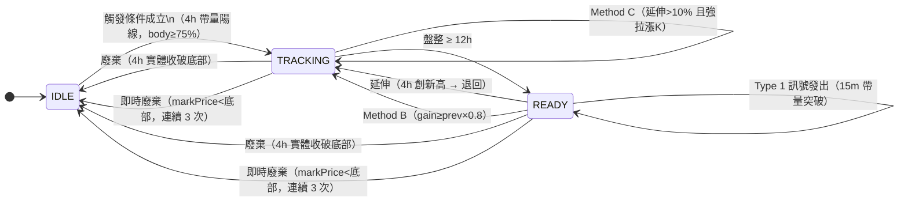

# Spec: Long Breakout Strategy（多頭盤整突破）

> **實作位置**：[app/strategy/long_breakout.py](../../app/strategy/long_breakout.py)  
> **對應訊號**：Type 1（做多）  
> **策略代號**：`long_breakout`

---

## 2026-06-22 變更摘要

| 項目 | 變更前 | 變更後 | 原因 |
|------|--------|--------|------|
| Pump 觸發 K 實體 | 無限制 | body/(high-low) ≥ 0.75 | 排除虛假上影線推動的假突破 |
| 突破 K 實體強度 | ≥ 60% | ≥ 75% | 強化進場 K 品質 |
| Method B 觸發條件 | gain > prev × 1.10 | gain ≥ prev × 0.8 | 降低更換門檻，更快跟上新基準 |
| Method B 適用狀態 | 僅 READY | TRACKING + READY 均適用 | 追蹤階段也需要更換過時基準 K |
| Taker Buy Ratio 驗證 | 有（> 65%） | 移除 | 回測顯示無明顯過濾效果 |
| 技術面濾波（SMA 200） | 有 | 移除 | 回測顯示無明顯過濾效果 |
| 止損距離過濾 | 無 | 3%–5% | 過窄易被掃、過寬盈虧比差 |
| 集體觸發過濾 | 無 | ≥ 3 筆同 15m 視窗整批冷卻 | 防市場雜訊引發批量誤訊號 |

### 現在的流程

#### K 線定義區（重要）

```
K 線結構圖：
        ↑ high（最高點，包括上影線）
        │
    ╔═══╗  ← close（收盤）
    ║   ║
    ╚═══╝  ← open（開盤）
        │
        ↓ low（最低點，包括下影線）
```

| 場景 | 使用部分 | 原因 |
|------|---------|------|
| `consolidation_high` 記錄 | **high**（影線最高點） | 定義盤整頂部範圍 |
| `consolidation_low` 記錄 | **low**（影線最低點） | 定義盤整底部範圍 |
| 4h 收盤廢棄判斷 | **min(open, close)**（實體最低） | 防止虛假下影線造成誤廢棄 |
| 15m 進場突破判斷 | **close**（收盤價） | 確認真實突破 |
| 即時廢棄判斷 | **markPrice** | 實時行情價格 |

#### 狀態機



#### 觸發條件（IDLE → TRACKING）

每根 4h K 棒收盤時評估，四條件同時成立：

| # | 條件 | 計算方式 |
|---|------|---------|
| 1 | 陽線 | `close > open` |
| 2 | 單根漲幅 ≥ 動態門檻 | `(close - open) / open × 100 >= PUMP_THRESHOLD`（2.5–3.5%，依 BTC 市況） |
| 3 | 實體佔幅 ≥ 75% | `(close - open) / (high - low) >= 0.75` |
| 4 | 量能 > 前 12 根均量 × 3 | `quote_volume / avg_12_4h > 3`（嚴格 `>`） |

**動態門檻**：BTC 1d K 漲幅 > 3% → 3.5%；-3% ~ 3% → 3.0%；< -3% → 2.5%

觸發後記錄：`consolidation_low`（K 棒 low）、`consolidation_high`（K 棒 high）、`consolidation_start_ts`（計時起點）、`pump_candle_*`（含成交量，供 Method B 比較）

#### 廢棄條件

**4h 收盤廢棄**：`min(open, close) < consolidation_low`（實體破底，下影線不觸發）

**即時廢棄**：`scan_strategy()` 每 10 秒檢查 `markPrice < consolidation_low`，需連續 ≥ 3 次確認才執行廢棄（防閃崩誤觸發）

#### TRACKING → READY

`(current_ts - consolidation_start_ts) / 3600 >= 12`，在每根 4h K 收盤最後一步評估。

#### Method B：強觸發 K 更換基準（TRACKING + READY 均適用）

前置體量驗證：`new_volume >= pump_candle_volume × 0.8`，不足則跳過。

| 情況 | 條件 | 行為 |
|------|------|------|
| 前觸發 K 漲幅 ≥ 10% | 任意符合觸發條件的新 K | **完整重置**：consolidation_low/high 皆換成新 K |
| 前觸發 K 漲幅 < 10% | 新 K 漲幅 ≥ prev × 0.8 | **局部重置**：consolidation_low 換新，consolidation_high 取 max（保留歷史最高） |

完整重置：phase = TRACKING，計時重置，pump_candle_* 全更新。

#### Method C：TRACKING 延伸超過 10% 後更換基準（僅 TRACKING）

**Gate 條件**：`(目前最高 - 原基準K棒 high) / 原基準K棒 high × 100 > 10%`

Gate 開啟後，延伸 K 若同時符合觸發條件（漲幅、body≥75%、量能≥3×）且體量 ≥ pump_candle_volume × 0.8，則更換基準 K 棒（is_method_b=True，頂部只進不退）。

#### Type 1 進場訊號（READY 狀態，15m K 收盤）

**突破確認（四條件同時成立）**：

| # | 條件 | 計算方式 |
|---|------|---------|
| 1 | 實體突破頂部 0.5% | `close > consolidation_high × 1.005` |
| 2 | 量能 ≥ 前 192 根均量 × 3.5 | `volume / avg_192_15m >= 3.5` |
| 3 | 實體強度 ≥ 75% | `(close - open) / (high - low) >= 0.75` |
| 4 | ATR 突破力度 | `close - consolidation_high >= ATR_14_4h × 0.30` |

**三層冷卻檢查**：①同一 consolidation 單次消耗 → ②全局 4h 冷卻 → ③同一 15m K 單次

**止損計算（非連續回掃）**：  
往回掃最多 20 根 15m K（不跨 4h 邊界），記錄所有 `volume > avg × 2.5` 的放量 K，取其中最低的 low。  
`stop_loss = max(min(放量K最低low, 當根low), consolidation_low)`

**止損距離過濾**：`risk_pct = (close - stop_loss) / close × 100`，需落在 [3%, 5%]，否則不發訊號。

**集體觸發過濾**：同一 15m 視窗累積 ≥ 3 支幣同時觸發，整批進入冷卻（各幣 last_alert_ts = now），本視窗不發任何訊號。

**回傳格式**：
```python
{
    "type": "type1", "symbol", "close", "stop_loss", "top", "bottom",
    "vol_ratio", "pump_time", "pump_high", "pump_low",
    "candle_open_time_ms", "candle_body_ratio", "breakout_atr_ratio",
    "risk_pct", "method_b_triggered",
}
```

#### 關鍵參數

| 參數 | 值 | 說明 |
|------|-----|------|
| `PUMP_THRESHOLD_BULL/NORMAL/BEAR` | 3.5 / 3.0 / 2.5 % | 動態觸發漲幅門檻 |
| `BTC_BULL_THRESHOLD / BEAR_THRESHOLD` | 3.0 / -3.0 % | BTC 市況判定門檻 |
| `TRIGGER_VOLUME_MULT` | 3 | 觸發量能倍數（嚴格 `>`） |
| `TRIGGER_VOLUME_BASELINE_N` | 12 | 量能基準根數 |
| `PUMP_BODY_RATIO` | 0.75 | 觸發 K 實體佔幅下限 |
| `CONSOLIDATION_MIN_HOURS` | 12 | 最低盤整時數 |
| `METHOD_B_RELAXED_THRESHOLD` | 10.0 | Method B Case 1 / Method C Gate 門檻（%） |
| `METHOD_B_VOLUME_RATIO` | 0.8 | Method B / C 體量驗證最低比例 |
| `BREAKOUT_VOLUME_MULT` | 3.5 | 突破量能倍數 |
| `BREAKOUT_BODY_PCT` | 0.005 | 突破實體超頂幅度（0.5%） |
| `BREAKOUT_BODY_RATIO` | 0.75 | 突破 K 實體強度下限 |
| `BREAKOUT_ATR_PERIOD` | 14 | ATR 計算週期（4h K 棒根數） |
| `BREAKOUT_ATR_RATIO` | 0.30 | ATR 突破力度門檻 |
| `LOOKBACK_VOLUME_MULT` | 2.5 | 止損回掃放量門檻倍數 |
| `BREAKOUT_RISK_PCT_MIN` | 3.0 | 止損距離下限（%） |
| `BREAKOUT_RISK_PCT_MAX` | 5.0 | 止損距離上限（%） |
| `BATCH_SIGNAL_LIMIT` | 3 | 集體觸發過濾門檻（筆） |
| `STRATEGY_COOLDOWN` | 14400 | 全局告警冷卻（秒） |
| `LIQUIDATION_BUFFER_CONFIRM_COUNT` | 3 | 即時廢棄確認次數 |

---

## 2026-06-04 V2 升級（含 2026-06-15 Method C）

| 項目 | V1 | V2 | 原因 |
|------|-----|-----|------|
| 觸發漲幅門檻 | 固定 3% | 動態 2.5–3.5%（依 BTC 市況） | 適應市場環境 |
| 進場 K 驗證 | 僅實體突破 0.5% | 加入實體強度（≥ 60%）+ ATR（≥ 30%） | 確保突破力度 |
| Pump 驗證 | 無 | Taker Buy Ratio ≥ 65% | 防對敲虛假成交 |
| 技術面濾波 | 無 | SMA 200 濾波（可配置） | 避免逆勢進場 |
| 止損回掃 | 連續放量 K（中斷即停） | 非連續，掃全部放量 K | 避免漏掉關鍵支撑 |
| 即時廢棄 | 單次觸發 | 三次確認（共約 30 秒） | 防閃崩誤廢棄 |
| 冷卻期 | 全局 4h 單層 | 三層機制（consolidation / 全局 / 15m K） | 增加機會同時防重複 |
| Method B 觸發 | 漲幅 > prev × 1.10 | 加入體量驗證（≥ 80%），漲幅 > prev × 1.10 | 防虛脫重置 |
| Method B 適用 | 僅 READY | 僅 READY（TRACKING 由 Method C 處理） | — |
| Method C | 無 | TRACKING 延伸 > 10% 後允許更換基準K棒 | 防基準K棒資料過時 |

### 現在的流程（V2 版）

**觸發**：4h 陽線，漲幅 ≥ 動態門檻（2.5–3.5%，依 BTC 1d 漲幅決定），量能 > 前 12 根均量 × 3 → TRACKING，記錄 pump_candle 含成交量。

**盤整追蹤**：
- 4h 實體破底 → IDLE（廢棄）
- markPrice 連續 3 次 < 底部 → IDLE（即時廢棄）
- 4h 創新高 → 更新頂部，重置計時，退回 TRACKING（若原為 READY）
  - 延伸 > 10% 且新強拉漲K（量能 ≥ 80%）→ Method C 更換基準K棒
- TRACKING ≥ 12h → READY

**進場**（READY，每根 15m K 評估）：
1. close > consolidation_high × 1.005
2. 技術面濾波：4h close ≥ SMA 200
3. 量能 ≥ 前 192 根均量 × 3.5，實體 ≥ 60%，ATR 突破 ≥ 30%
4. Pump Candle Taker Buy Ratio ≥ 65%
5. 三層冷卻通過
6. 止損 = 非連續回掃放量K最低點（最多 20 根，不跨 4h 邊界）

**READY 狀態下出現觸發K**：Method B（體量 ≥ 80%，漲幅 > prev × 1.10）→ 更換基準，退回 TRACKING

---

## V1 基準

| 項目 | 行為 |
|------|------|
| 觸發 | 4h 陽線 > 3%（固定）+ 量能 > 前 12 根均量 × 3 → TRACKING |
| 盤整追蹤 | 4h 實體破底廢棄；markPrice < 底部單次廢棄；4h 創新高重置計時 |
| READY | 盤整 ≥ 12h |
| 進場 | 15m close > top × 1.005 + 量能 ≥ 前 192 根均量 × 3.5 |
| 止損 | 往回連續放量K的最低點（中間一根低量即停止） |
| 即時廢棄 | 單次觸發即廢棄 |
| 冷卻 | 全局 4h |
| Method B | READY 時新 K 漲幅 > prev × 1.10（無體量驗證） → 更換基準 |
| Method C | 無 |

---

## 涉及檔案（移除此策略時需全部檢查）

| 檔案 | 要找什麼 |
|------|---------|
| `app/strategy/long_breakout.py` | 整個檔案刪除 |
| `app/strategy/state_machine.py` | `from .long_breakout import ...` 及所有 dispatch 呼叫 |
| `app/strategy/strategy_alerts.py` | `"type1"` 訊號格式化函式與路由 |
| `app/setting/models.py` | `strategy_state` 容器定義 |
| `app/datacenter/binance_opendata.py` | `on_new_4h_candle` / `on_new_15m_candle` dispatch |
| `app/trading/order_manager.py` | `_SIGNAL_TO_STRATEGY` 的 `"type1"` key |
| `app/command/command.py` | `/tracking long` 指令 |
| `backtest/run.py` | `ALL_STRATEGIES` 清單 |
| `tests/test_state_machine.py` | 狀態機測試 |
