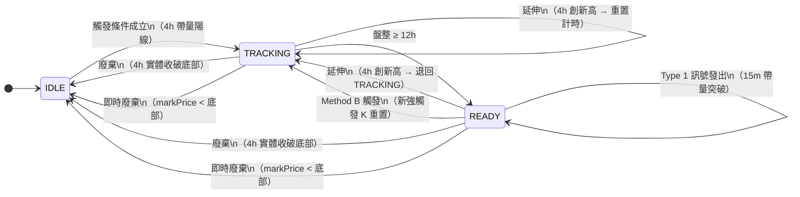

# Spec: Long Breakout Strategy（多頭盤整突破）

> **實作位置**：[app/strategy/long_breakout.py](../../app/strategy/long_breakout.py)  
> **對應訊號**：Type 1（做多）  
> **策略代號**：`long_breakout`

---

## 狀態機總覽



---

## 狀態說明

| 狀態 | 意義 |
|------|------|
| `IDLE` | 無進行中的盤整，等待觸發 K 棒出現 |
| `TRACKING` | 觸發後追蹤盤整，等待足夠盤整時間累積 |
| `READY` | 盤整成熟，監控 15m K 棒等待突破進場 |

---

## 觸發條件（IDLE → TRACKING）

每根 4h K 棒收盤時評估，**以下三條件須同時成立**：

| # | 條件 | 計算方式 |
|---|------|---------|
| 1 | 陽線 | `close > open` |
| 2 | 單根漲幅 ≥ 3% | `(close - open) / open × 100 >= PUMP_THRESHOLD` |
| 3 | 量能 > 前 12 根均量 × 3 | `quote_volume / avg_12_4h > TRIGGER_VOLUME_MULT`（嚴格 `>`） |

> `avg_12_4h`：取 `kline_4h_ohlc` 最後 13 根中的**前 12 根**（排除當根）的 quote_volume 平均值。

觸發後記錄：

| 欄位 | 值 |
|------|----|
| `consolidation_low` | 觸發 K 棒的 `low`（廢棄線） |
| `consolidation_high` | 觸發 K 棒的 `high`（突破目標） |
| `consolidation_start_ts` | 觸發 K 棒的 `open_time_ms / 1000`（計時起點） |
| `pump_candle_*` | 觸發 K 棒完整資訊（用於 Method B 比較與告警訊息） |

---

## 延伸條件（重置計時，退回 TRACKING）

適用狀態：`TRACKING`、`READY`

**條件**：4h `high > consolidation_high`

**行為**：
- 更新 `consolidation_high = high`
- 重置 `consolidation_start_ts = 當根 open_time / 1000`
- 狀態強制回到 `TRACKING`（若原本是 READY 則退回）
- 立即重新評估是否達到 12h → 若當根時間距離等於或超過 12h，會再次進入 READY

---

## 廢棄條件（→ IDLE）

### 4h 收盤廢棄

**條件**：`min(open, close) < consolidation_low`（實體低點，不含下影線）

**行為**：重置為 IDLE

### 即時廢棄

**條件**：`markPrice < consolidation_low`（每 10 秒 `scan_strategy()` 檢查）

**行為**：
- 重置為 IDLE
- **不**發出廢棄事件，不觸發空頭策略

---

## TRACKING → READY 條件

**條件**：`(current_ts - consolidation_start_ts) / 3600 >= CONSOLIDATION_MIN_HOURS`（12h）

在每根 4h K 棒收盤後的最後一步評估（延伸/觸發處理完之後）。

---

## Method B：READY 狀態下的強觸發重置

**適用狀態**：僅 `READY`（`TRACKING` 中出現觸發 K 不處理 Method B）

當 READY 狀態下出現符合觸發條件的 4h 陽線帶量 K，依照前觸發 K 漲幅分兩種處理：

### Case 1：前觸發 K 漲幅 > 10%（寬鬆重置）

```
prev_gain > METHOD_B_RELAXED_THRESHOLD
→ 完整重置（is_method_b=False）
   consolidation_low  = 新觸發 K low
   consolidation_high = 新觸發 K high
   pump_candle_* 全部更新
   phase = TRACKING（重新計時）
```

### Case 2：前觸發 K 漲幅 ≤ 10%（需比較漲幅優勢）

> **漲幅定義**：兩個比較值都是**實體漲幅** `(close - open) / open × 100`，不使用 high。

```
新觸發 K 實體漲幅 > prev_gain × (1 + METHOD_B_GAIN_ADVANTAGE / 100)
即：新實體漲幅 > prev_gain × 1.10（預設）
→ Method B 重置（is_method_b=True）
   consolidation_low  = 新觸發 K low
   consolidation_high = max(舊 consolidation_high, 新觸發 K high)
   pump_candle_* 全部更新
   phase = TRACKING（重新計時）
```

> **差異**：Case 1 完整重置頂部；Case 2 保留舊頂部若比新觸發 K 高（避免退縮突破目標）。

---

## Type 1 進場訊號（做多）

**適用狀態**：`READY`

每根 15m K 棒收盤時評估，**以下條件須同時成立**：

| # | 條件 | 計算方式 |
|---|------|---------|
| 1 | 實體突破頂部 0.5% | `close > consolidation_high × (1 + BREAKOUT_BODY_PCT)` |
| 2 | 量能 ≥ 前 192 根均量 × 3.5 | `volume / avg_192_15m >= BREAKOUT_VOLUME_MULT`（`>=`） |
| 3 | 冷卻期已過 | `time.time() - last_alert_ts >= STRATEGY_COOLDOWN`（4h） |

> `avg_192_15m`：取 `kline_15m_ohlc[-193:-1]`（最近 192 根，排除當根未完成 K）。

### 止損計算

起始止損 = 當根 15m K 的 `low`

**向前回掃連續放量 K 的最低點**：

```
從倒數第 2 根 15m K 開始往回掃
  若 candle.open_time < 當前 4h 開盤時間 → 停止
  若 candle.volume > avg_192_15m × LOOKBACK_VOLUME_MULT (2.5×) → stop_loss = min(stop_loss, candle.low)
  否則 → 停止（連續性中斷即停）
```

回傳格式：
```python
{
    "type":                "type1",
    "symbol":              symbol,
    "close":               close,           # 進場價
    "stop_loss":           stop_loss,
    "top":                 consolidation_high,
    "bottom":              consolidation_low,
    "vol_ratio":           vol_ratio,
    "pump_time":           pump_candle_time,
    "pump_high":           pump_candle_high,
    "pump_low":            pump_candle_low,
    "candle_open_time_ms": open_time_ms,
}
```

---

## 邊界案例

| 情境 | 行為 |
|------|------|
| 觸發 K 同一根同時滿足廢棄（low < consolidation_low） | 先廢棄判斷、再觸發判斷，廢棄優先 |
| TRACKING 中出現更強的觸發 K | **不處理** Method B，只處理延伸或廢棄 |
| 15m 進場但無 `kline_15m_ohlc` 或不足 193 根 | 跳過，不發訊號 |
| 即時廢棄發生後 4h 又收盤廢棄 | 即時廢棄已重置為 IDLE，4h 廢棄對 IDLE 狀態無作用（無事件發出） |
| Method B 後，`consolidation_start_ts` 重置 | 新觸發 K 的 `open_time` 作為計時起點，從頭累積 12h |

---

## 明確排除（不在此策略範圍）

- **下影線**不觸發廢棄，只有實體 `min(open, close)` 才算
- **即時廢棄**（markPrice）與 **4h 收盤廢棄**行為相同，都只是重置多頭狀態
- **TRACKING 狀態**下不處理 Method B
- **止損回掃**限定在當前 4h K 開盤時間之後，不跨 4h 邊界

---

## 關鍵參數

| 參數 | 預設值 | 說明 |
|------|--------|------|
| `PUMP_THRESHOLD` | 3 | 觸發 K 漲幅門檻（%） |
| `TRIGGER_VOLUME_MULT` | 3 | 觸發量能倍數（嚴格 `>`） |
| `TRIGGER_VOLUME_BASELINE_N` | 12 | 量能基準根數（前 N 根 4h） |
| `CONSOLIDATION_MIN_HOURS` | 12 | 最低盤整時數 |
| `METHOD_B_GAIN_ADVANTAGE` | 10.0 | Method B 漲幅優勢門檻（%） |
| `METHOD_B_RELAXED_THRESHOLD` | 10.0 | 寬鬆重置啟動的前觸發 K 漲幅門檻（%） |
| `BREAKOUT_VOLUME_MULT` | 3.5 | Type 1 突破量能倍數（`>=`） |
| `BREAKOUT_BODY_PCT` | 0.005 | Type 1 突破實體幅度（0.5%） |
| `LOOKBACK_VOLUME_MULT` | 2.5 | 止損回掃放量門檻倍數 |
| `STRATEGY_COOLDOWN` | 14400 | 告警冷卻（秒，4h） |
